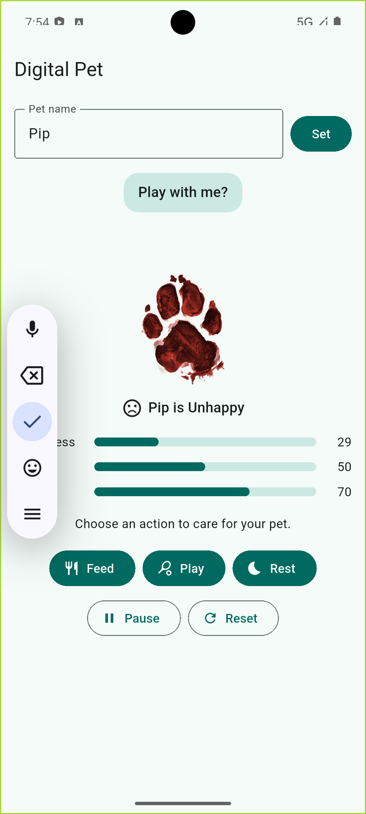
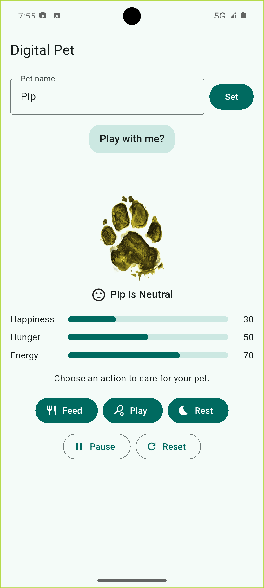
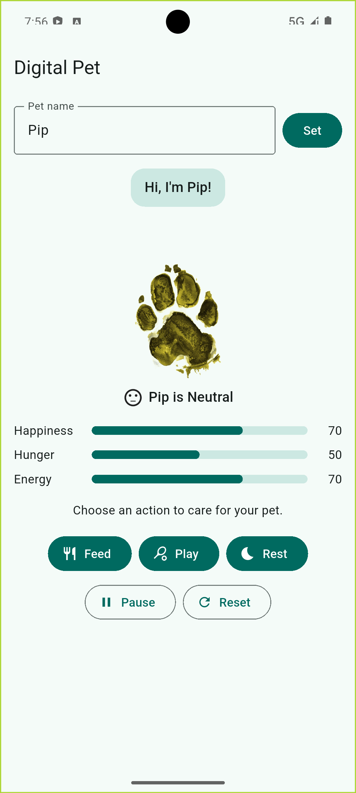
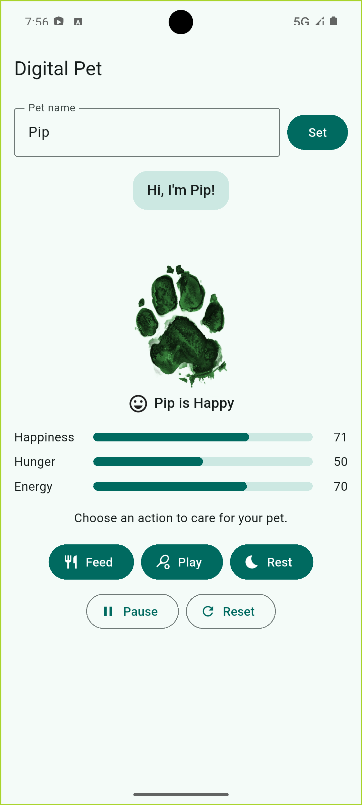

# Digital Pet (In-Class Activity 07)

A Flutter pet-care app where user actions and time change the pet's state. Built for Mobile Application Development, Fall 2026.

## Team
| Member            | Team / Workstream | Pathway |
|-------------------|---|---|
| Snigdha Addagarla | Team 1: Care Systems (state, timers, outcomes) | Undergraduate |
| Moksha Annam      | Team 2: Pet Personality (visuals, README, review) | Undergraduate |

Repository: https://github.com/sniggy2610-05/digital-pet-inc07

## Setup and run
```bash
git clone https://github.com/sniggy2610-05/digital-pet-inc07.git
cd digital-pet-inc07
flutter pub get
flutter run
flutter build apk --release
```

## Game rules
- Happiness, hunger and energy are always kept between 0 and 100.
- **Feed:** hunger -10. Happiness +10, or -20 if hunger drops below 30 (overfeeding).
- **Play:** happiness +15, hunger +10, energy -15. Blocked if energy is below 10.
- **Rest:** energy +30, hunger +5.
- **Hunger timer:** hunger +5 every 30 seconds. A tick that would go above 100 sets hunger to 100 and lowers happiness by 20.
- **Win:** happiness strictly above 80 for 3 continuous minutes. The timer is cancelled as soon as happiness is 80 or below.
- **Loss:** hunger is 100 and happiness is 10 or lower.
- After a win or loss, care actions are disabled until Reset.

## Selected advanced features (undergraduate: 2 required, 3 implemented)
| Feature | Learning outcome | Evidence |
|---|---|---|
| Energy system | Bounded meters with action costs and recovery | Play costs 15 energy and is blocked below 10; Rest gives +30 |
| Session controls | Safe timer handling on pause, resume and reset | Pause cancels the hunger and win timers; Resume restarts a fresh hunger timer and win countdown; Reset restores 50/50/70 with one hunger timer |
| Visual polish and accessible motion | UI derived from state; motion respects accessibility settings | Action bounce, animated meters, speech bubble switcher, action reaction emoji, mood tint and size; animations are disabled when the device's reduced-motion setting is on |

## Architecture
- `lib/pet_model.dart`: pet rules (plain Dart, no widgets)
- `lib/pet_screen.dart`: owns timers and state, calls `setState()`
- `lib/pet_widgets.dart`: presentation widgets
- `lib/main.dart`: app entry point

## Accessibility
Mood is shown by a text label and an icon as well as the color tint, so color is never the only signal. Meters have numeric values and semantic labels. Reduced-motion mode removes the bounce, sliding and meter animations.

## Manual test evidence
Timers were shortened for testing (hunger 5 s, win 10 s) and restored to 30 s and 3 min before the release build.

| Scenario | Before | After | Result |
|---|---|---|---|
| Feed at low hunger | hunger: __ | hunger: __ | stays at 0 or above; happiness penalty applied |
| Play at high happiness | happiness: __ | happiness: __ | does not exceed 100 |
| Play with energy under 10 | energy: __ | energy: __ | "too tired" message, meters unchanged |
| Hunger from 95 to 100, then another tick | hunger: __ | hunger: __ | first tick no penalty; next tick happiness -20 |
| Mood at 29 | | | Unhappy, red |
| Mood at 30 | | | Neutral, yellow |
| Mood at 70 | | | Neutral, yellow |
| Mood at 71 | | | Happy, green |
| Happiness drops to 80 before win timer ends | | | No win; timer cancelled |
| Happiness stays above 80 for the full timer | | | "You win!"; buttons disabled |
| Hunger 100 and happiness 10 or lower | | | "Game over"; buttons disabled |
| Pause, Resume, Reset | | | Hunger stops while paused; Reset restores 50/50/70 |
| Reduced motion on | | | No bounce or sliding |
| Release APK installed and launched | | | Core actions work on-device |

### Screenshots
| | |
|---|---|
|  |  |
|  |  |


## Assets
`assets/pet.png`: SOURCE URL. License: LICENSE NAME.

## Collaboration
- Pull requests: PASTE PR LINKS HERE
- Issues: PASTE ISSUE LINKS HERE
- Contributions: YOUR NAME built the care systems, state rules, timers, session controls, widgets, and testing. TEAMMATE NAME: DESCRIBE WHAT SHE ACTUALLY DID.